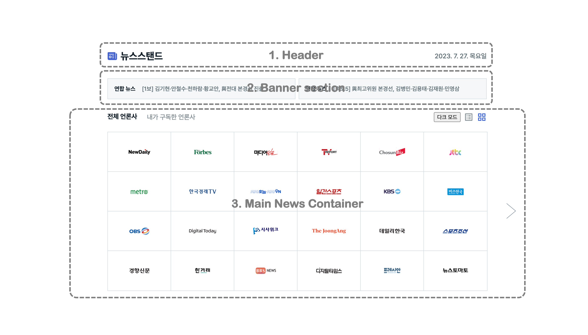

# 뉴스스탠드 구현

### 🏠 레이아웃

1. 기본 상단 영역
2. 최신 뉴스 자동롤링 영역
3. 언론사별 기사들을 확인하는 영역

### ✨ FEATURE1

-   오른쪽 시스템 날짜 표시

### ✨ FEATURE2

-   왼쪽 바와 오른쪽 바 각각 다른 최신 뉴스 헤드라인 5개가 5초마다 무한 자동 롤링
-   마우스 호버할 경우, 무한 롤링 일시정지 && 헤드라인에 밑줄 표시

### ✨ FEATURE3

-   **전체 언론사**, **내가 구독한 언론사** 탭 변경 가능
-   **그리드 아이콘**, **리스트 아이콘** 클릭 시 뉴스스탠드 모드 변경 가능
-   **전체 언론사**, **그리드 보기** 가 기본 상태
-   다크모드 버튼 클릭하여 다크모드로 변경 가능
-   **구독하기** 버튼 클릭할 경우: 스낵바 5초간 유지 후, 즉시 내가 구독한 언론사 리스트 보기 화면으로 이동
-   **해지하기** 버튼 클릭할 경우: 구독해지 알림 뜨고, 해지할 경우 즉시 구독해지 및 다음 순서의 언론사로 이동

    #### FEATURE 3-1. 그리드 보기

    -   6x4 테이블의 각 셀에 언론사 브랜드 마크 배치
    -   언론사 브랜드 마크의 순서는 페이지 새로고침할때마다 랜덤으로 배치
    -   그리드 좌우 화살표로 페이지 넘기는 기능(가장 첫 페이지와 가장 끝 페이지에는 화살표 표시하지 않음)
    -   그리드 셀 호버할 경우 **구독하기** 버튼 나타남 (이미 구독한 경우는 **해지하기** 버튼 나타남)
    -   그리드를 다 채우지 못할 경우, 비어 있음

    #### FEATURE 3-2. 리스트 보기

    -   각 분야 카테고리의 기사 확인 (카테고리 이름 옆에 현재 언론사 순서 표시)
    -   한 언론사당 20초마다 화면 보여지고, 카테고리 영역에 색이 차오르도록 애니메이션 적용
    -   카테고리의 마지막 언론사 다음은 다음 카테고리로 넘어감 (가장 마지막 카테고리 경우 첫 언론사로 돌아옴)
    -   좌우 화살표를 통해 즉시 언론사 이동 가능(프로그레스바 다시 시작)
    -   내가 구독한 언론사의 가로 탭을 넘어가는 경우, 스크롤 가능

### 💡고민했던 점

-   옵저버 패턴을 활용하여 모드 변경과 내가 구독한 언론사 리스트를 관리함
-   다크모드 구현시 css활용하여 구현
