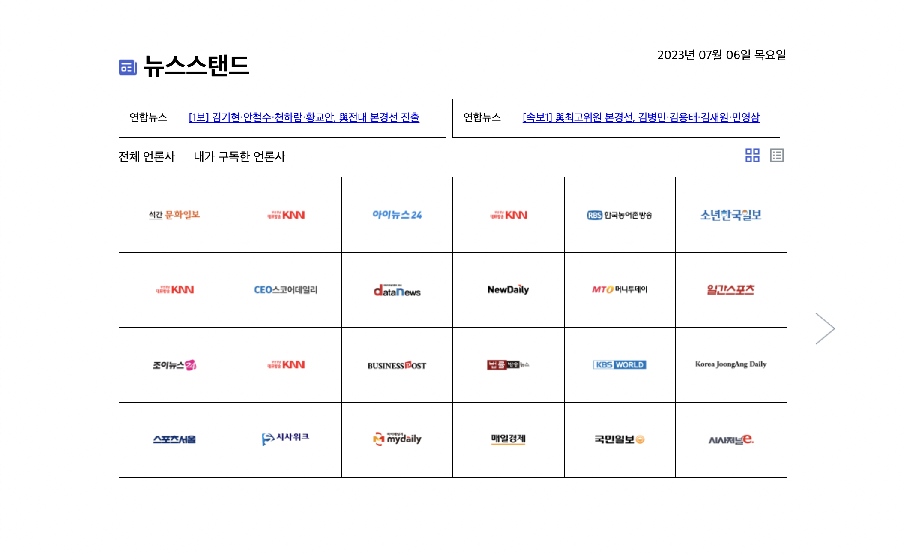
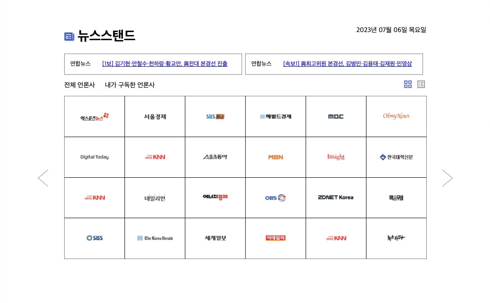

1. 레이아웃 설계
   
   
2. 네이밍 규칙
    - id : camelCase (class 명이랑 중복 x)
    - class : underscore (요소 기능을 포함해야함)

---

### 7.6 (목), 7.7 (금)

-   [x] 레이아웃 구성
-   [x] 클래스 분류 (코드 정리)
-   [x] 데이터 정리
    -   [x] 뉴스 배너 데이터
    -   [x] 언론사 이미지 데이터
-   [x] 언론사 랜덤 배치
-   [x] 화살표 이벤트
    -   [x] 페이지 넘김
    -   [x] 첫번째랑 마지막 화살표 한개만 (disabled 설정)
-   [x] 레이아웃 재구성 및 스타일 추가
-   [x] 클릭 이벤트 구현
-   [x] 데이터 정리

### 7.10 (월)

-   [ ] list_view 만들기
-   [ ] 자동 롤링 구현
-   [ ] 모듈화
