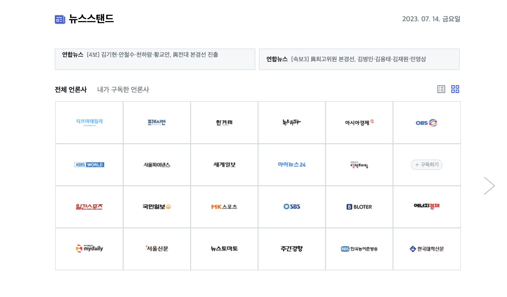
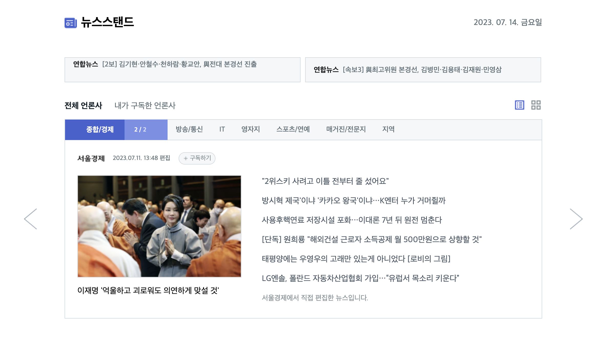
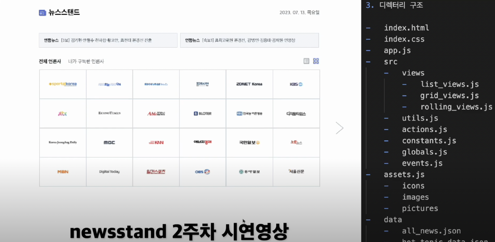

<<<<<<< HEAD

=======

1. 레이아웃 설계

    
    

2. 시연 영상
   [](https://www.youtube.com/watch?v=KOVuUW7YreQ)

3. 네이밍 규칙

    - HTML, CSS
        - id : `camelCase`
        - class : `underscore`
            - 요소 기능 포함할 것
            - 4번 이상 참 조하지 않도록 설계할 것
    - JS
        - function : `camelCase`
        - variable
            - constant : `UPPERCASE`
            - function scope : `camelCase`
            - global scope : `single tone` || `underscore`

4. 디렉터리 구조

```
fe-newsstand
├── app.js
├── assets
│   ├── icons
│   ├── images
│   └── pictures
├── data
│   ├── all_news.json
│   ├── hot_topic_data.json
│   └── press_data.json
├── docs
├── index.css
├── index.html
├── readme.md
└── src
    ├── actions.js
    ├── constants.js
    ├── events.js
    ├── globals.js
    ├── utils.js
    └── views
        ├── grid_views.js
        ├── list_views.js
        ├── rolling_views.js
        └── snack_bar_views.js
```

5. 구현 체크리스트

    - [x] 레이아웃 영역 나누기
    - 최신 뉴스 오토 롤링
        - [x] 호버 이벤트
    - 그리드 보기
        - [x] 화살표 배치 및 페이지 이동
        - [x] 호버 이벤트
    - 리스트 보기
        - [x] 네비게이션 메뉴, 프로그레시브 바
        - [x] 페이지 이동
        - [ ] 호버 이벤트
    - 스낵바 알림
        - [x] 그리드 보기
        - [ ] 리스트 보기
    - 언론사 구독 기능
        - [ ] 그리드 보기
        - [ ] 리스트 보기
        - [ ] 구독 해지 기능
    - 추가 기능
        - [x] 다크모드

6. 모델 구조 개요
    - 모든 event는 event.js에서 정의됩니다. 정의된 event는 initEvent, conditionEvent로 분류되며, 시작부터 끝까지 사용되는 event는 initEvent로 바로 호출되며, 조건에 따라 conditionEvent가 호출됩니다. 호출된 event는 실행 될 행동을 action에서 가져옵니다. action에 따라 최종적으로 보여지는 view는 달라집니다.

---

### 7.19 (수)

-   list_views 구독 구현
-   리팩토링
    -   함수명 변경
    -   구조 및 함수 옵션에 따른 분류

### 7.17 (월), 7.18 (화)

-   구독 언론사 데이터 관리
-   grid toggle table 수정
-   rolling_views.js 모듈화
-   grid 스낵바 구현
-   렌더링 최적화
    -   다크모드에서 렌더링 되는 요소
    -   페이지를 넘기면서 렌더링 되는 요소

### 7.14 (금)

-   list_view 호버 이벤트 구현
    -   카테고리 호버 이벤트
    -   썸네일 호버 이벤트
-   querySelector 구현해보기
-   다크모드 구현
    -   css 모듈화

### 7.13 (목)

-   데이터 추가 및 확장성
    -   all_news 데이터 추가
    -   중복 제거 및 함수 리팩토링
-   grid_view 토글 구현
    -   구독하기 버튼 만들기
    -   hover toggle 구현
-   모듈화
    -   evnet.js 쪼개기

### 7.11 (화), 7.12 (수)

-   list_view 구현
    -   main_nav 구현
        -   nav 클릭 구현
        -   프로그레시브 바 구현
    -   데이터 정리
-   list_view, grid_view 이벤트 분류
-   event 모듈로 통합, 함수로 구현
-   모듈화
    -   디렉터리 네이밍 및 폴더 네이밍

### 7.10 (월)

-   list_view 만들기
-   자동 롤링 구현
-   모듈화

### 7.6 (목), 7.7 (금)

-   레이아웃 구성
    -   클래스 분류 (코드 정리)
-   데이터 정리
    -   뉴스 배너 데이터
    -   언론사 이미지 데이터
-   언론사 랜덤 배치
-   화살표 이벤트
    -   페이지 넘김
    -   첫번째랑 마지막 화살표 한개만 (disabled 설정)
-   레이아웃 재구성 및 스타일 추가
-   클릭 이벤트 구현
-   데이터 정리
    > > > > > > > upstream/main
