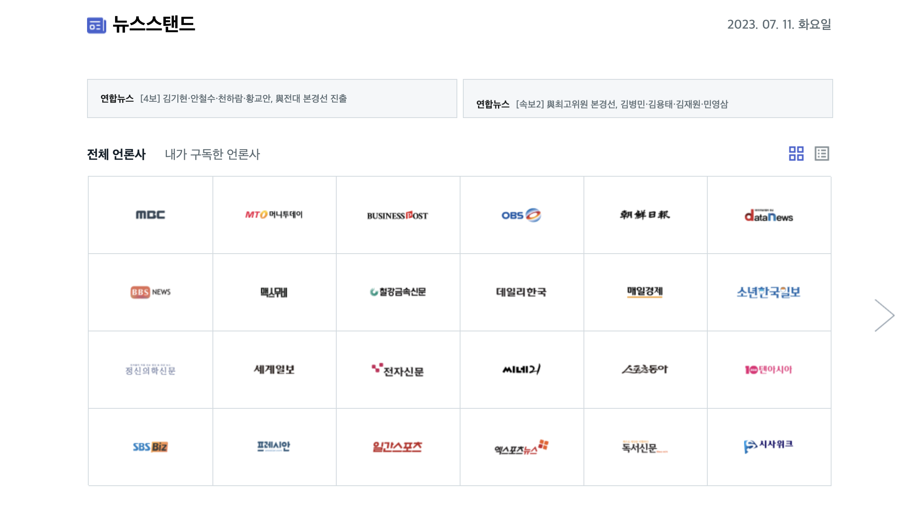
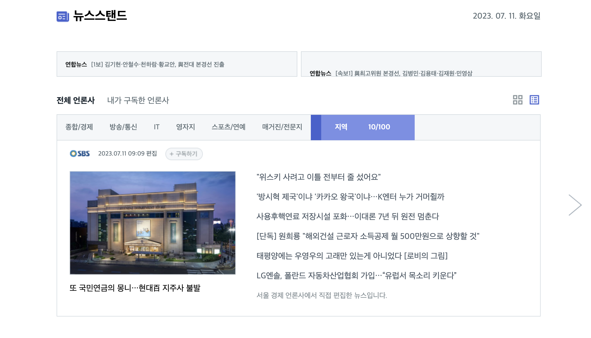

1. 레이아웃 설계

    
    

2. 네이밍 규칙

    - HTML, CSS
        - id : `camelCase`
        - class : `underscore`
            - 요소 기능 포함할 것
            - 4번 이상 참 조하지 않도록 설계할 것
    - JS
        - function : `camelCase`
        - variable
            - constant : `UPPERCASE`
            - function scope : `camelCase`
            - global scope : `single tone` || `underscore`

3. 디렉터리 구조

-   index.html
-   index.css
-   app.js
-   src
    -   views
        -   list_views.js
        -   grid_views.js
        -   rolling_views.js
    -   utils.js
    -   actions.js
    -   constants.js
    -   globals.js
    -   events.js
-   assets.js
    -   icons
    -   images
    -   pictures
-   data
    -   all_news.json
    -   hot_topic_data.json
    -   press_data.json

4. 구현 체크리스트

-   [x] 레이아웃 영역 나누기
-   최신 뉴스 오토 롤링
    -   [x] 호버 이벤트
-   그리드 보기
    -   [x] 화살표 배치 및 페이지 이동
    -   [x] 호버 이벤트
-   리스트 보기
    -   [x] 네비게이션 메뉴, 프로그레시브 바
    -   [x] 페이지 이동
    -   [ ] 호버 이벤트
-   언론사 구독 기능
    -   [ ] 그리드 보기
    -   [ ] 리스트 보기
    -   [ ] 구독 해지 기능
-   추가 기능
    -   [ ] 다크모드
    -   [ ] 반응형 (모바일)

---

### 7.13 (목)

-   데이터 추가 및 확장성
    -   all_news 데이터 추가
    -   중복 제거 및 함수 리팩토링
-   grid_view 토글 구현
    -   구독하기 버튼 만들기
    -   hover toggle 구현
-   모듈화
    -   evnet.js 쪼개기

### 7.11 (화), 7.12 (수)

-   list_view 구현
    -   main_nav 구현
        -   nav 클릭 구현
        -   프로그레시브 바 구현
    -   데이터 정리
-   list_view, grid_view 이벤트 분류
-   event 모듈로 통합, 함수로 구현
-   모듈화
    -   디렉터리 네이밍 및 폴더 네이밍

### 7.10 (월)

-   list_view 만들기
-   자동 롤링 구현
-   모듈화

### 7.6 (목), 7.7 (금)

-   레이아웃 구성
    -   클래스 분류 (코드 정리)
-   데이터 정리
    -   뉴스 배너 데이터
    -   언론사 이미지 데이터
-   언론사 랜덤 배치
-   화살표 이벤트
    -   페이지 넘김
    -   첫번째랑 마지막 화살표 한개만 (disabled 설정)
-   레이아웃 재구성 및 스타일 추가
-   클릭 이벤트 구현
-   데이터 정리
