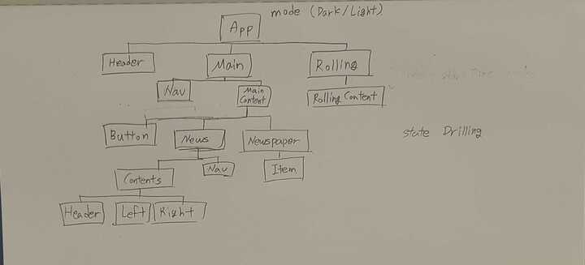

# fe-newstand


# 뉴스 스탠드 설계

## 개발 기준

1. 컴포넌트 추상화 단계 통일하기
2. Fetch해오는 데이터 형식이 변경되어도 유지보수가 용이하도록 데이터 처리 함수 분리하기
3. 디렉토리 구조 신경 쓰기

- 코드를 보다 체계적으로 구조화하고 깔끔하게 만듦으로써 다른 개발자가 작업하던 코드를 받아도 빠르게 작업을 이어나갈 수 있다

4. JSDoc으로 주석 작성하기

파일 형태

```
/* 이 파일의 목적과 기능 */

… code
```

## 설계 순서

1. 컴포넌트 아키택처 설계
2. State/props 설계
3. 디렉토리 구조 설계
4. 기능 설계

### 컴포넌트 아키택처 설계



### State/props 설계

- State

  - App state: light, dark
  - Main state: newspaper, news, my, all
  - Newspaper state: my, all, page
  - News state: my, all
  - News/Nav state: page, category
  - News/Contens: page, category

- 공통 State

  - Dark/light: 애플리케이션 컴포넌트 전체
  - My/all: Main, Newspaper, News
  - Page: Newspaper, News/Nav,, News/Contents
  - Category: News, News/Nav, News/Contents

- Props
  - Main props: left/right(Button), my/all, page
  - Rolling props: start time(롤링 시간이 달라야 한다는 요구 사항이 있음)
  - News props: page, category

### 디렉토리 구조 설계

컴포넌트 폴더에 하위 컴포넌트들의 폴더 생성을 반복(컴포넌트 트리 구조를 디렉토리로 재구성)

```
fe-newsstand
├─ .gitignore
├─ README.md
├─ assets
│  ├─ img
│  └─ newspaper
│     ├─ dark
├─ css
│  ├─ header.css
│  ├─ index.css
│  ├─ list.css
│  ├─ main.css
│  ├─ news.css
│  ├─ reset.css
│  ├─ section.css
│  └─ util.css
├─ image-1.png
├─ image.png
├─ index.html
├─ index.js
├─ package.json
└─ src
   ├─ App.js
   └─ App
      ├─ Header.js
      ├─ Rolling.js
      ├─ Main.js
      ├─ Rolling
      │  └─ RollingContents.js
      └─ Main
         ├─ ContentNav.js
         ├─ MainContent.js
         ├─ ContentNav
         │  ├─ Button.js
         │  ├─ PressType.js
         │  └─ ViewerType.js
         └─ MainContent
            ├─ NewsListView.js
            ├─ PressGridView.js
            ├─ Button.js
            └─ NewsListView
              ├─ CategoryNav.js
              ├─ Contents.js
              └─ Contents
                  ├─ Header.js
                  ├─ News.js
                  └─ News
                     ├─ MainNews.js
                     └─ SubNews.js
```

### 컴포넌트 기능 설계

App: 페이지의 light/dark 모드 전환

Header: 페이지의 메인 해더, 타이틀과 날짜를 포함

Main: 페이지의 메인 컨텐츠(신문사/뉴스기사)를 렌더링하는 컴포넌트, 구독한 언론사와 전체 언론사를 컴포넌트 상태에 따라 렌더링, left/right(Button), my/all, page를 하위 컴포넌트(Newspaper, News)로 드릴링하여 렌더링 할 컨텐츠 선택

Rolling: 최근 기사를 무한 롤링하는 컴포넌트, props로 롤링 시간을 조절

Main/Nav: 메인 컴포넌트의 contents state를 newspaper/news로 전환하는 기능, 메인 컴포넌트의 my/all을 전환하는 기능
Main/Button: 현재 렌더링 중인 컨텐츠 전환, Main 컴포넌트의 page 상태를 변화시킴
Main/Newspaper: my/all, page props에 따라 신문사 컨텐츠 렌더링, 각 신문사 컴포넌트에 구독 기능(구독 버튼)
Main/News: my/all, page props, category state에 따라 기사 컨텐츠 렌더링

Main/News/Nav: my/all, page, category에 따라 카테고리와 페이지에 맞는 기사 컨텐츠 렌더링, News 컴포넌트의 category 상태 변경(카테고리 클릭시, 마지막 기사에서 다음 기사로 이동할 시), News 컴포넌트의 page 상태 전환(20초 progress)

Main/News/Contents: my/all, page, category에 따라 기사 컨텐츠 렌더링
Main/News/Contents/Header: 렌더링된 기사의 해더(신문사, 편집 날짜, 구독 버튼)
Main/News/Contents/Left: 해당 카테고리, 페이지 신문사의 첫 헤드라인 렌더링(이미지, 타이틀)
Main/News/Contents/Right: 해당 카테고리, 페이지 신문사의 나머지 헤드라인 렌더링(타이틀 리스트)
